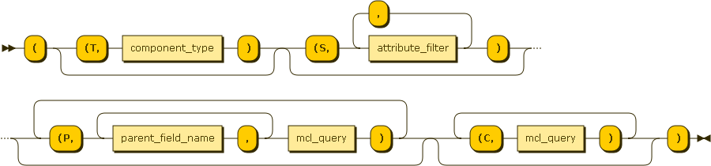
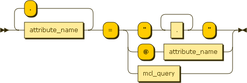
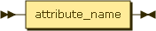

MCL
############

.. _mclquery:

Introduction
-----------------------

MCL is a sadistic parenthesis-oriented query and component creation language. It allows to find components based on its attributes and, most important, based on the relationships it has with other components. That way, scripts may easily find all the data they need to run. For exemple, just knowing the hostname of the server it runs on, a script will be able to query all database accounts running on databases running on this server, and then backup or export them.

Grammar (EBNF)
-----------------------

.. productionlist:: 
	mcl_query ::= '(' ('(T,' component_type ')' )? ('(S,' attribute_filter (',' attribute_filter)* ')')? ('(P,' (parent_field_name ',')+ mcl_query ')')* ('(C,' mcl_query ')')* ')'
	attribute_filter ::= attribute_name ('.' attribute_name)* '=' (('"' .+ '"') | '@' attribute_name | mcl_query )
	attribute_name ::= [a-zA-Z0-9_]+
	parent_field_name ::= attribute_name 

	
*mcl_query*: 

*attribute_filter*:

*attribute_name*:

.. image:: media/attribute_name.png	

*parent_field_name*:

*Diagrams generated with http://railroad.my28msec.com/rr/ui*

How to query
-----------------------

MCL is a **filter** language. That means that it works in a negative fashion: you begin with every existing omponent instances, and the more filters you add, the less instances survive. It also means that everything is optional in MCL, but the outer parenthesis - in this case, every single last instance is returned.

This section introduces all the different filters, from the simplest to the more complicated.

Query on attributes (simple)
++++++++++++++++++++++++++++++++++++++++++++

In this case, the user knows a few attributes (usually the name) of the required component instance.::

	(S,attribute="value",otherattribute="othervalue",...)
	
S means Self. Double inverted commas are compulsory. In case there are some in the value, double them to escape them.

.. warning:: if no type is given (see next paragraph), only base instance attributes can be queried (name, description)

.. note:: Queriable attributes will one day be documented automatically. Right now it should be done manually.

Exemples:::

	((S,name="waPRDINT2"))
	((S,environments="PRD1"))
	((S,description="it's ""beautiful""",name="marsupilami"))

Query on type
++++++++++++++++++++++++++++++++++++++++++++

There are many component instance types: Oracle instances, web servers, batch programs, etc. To filter on this:::

	(T,componenttype)
	
T means Type.

Example::

	((T,wascluster))

Query on attributes (reference)
++++++++++++++++++++++++++++++++++++++++++++

In this case, the user doesn't know the value of an attribute but knows it is equal to another attribute.::

	(S,attribute=@otherattribute)
	
Note the absence of inverted commas.

Exemple::

	((S,login=@password))
	
Query on attributes (relations)
++++++++++++++++++++++++++++++++++++++++++++

In this case, the query is on the attributes of a related instance.::

	(S,linkattribute.attribute="value")
	
Beware in this case if you use the @ notation - it refers to the base instance, not the related one. There could be more than two levels.

Exemple::

	((S,instance.name="MYORACLEINSTANCE"))
	((S,environments.name="PRD1"))
	
looks for every component instance which has an instance named MYORACLEINSTANCE.

Query on parents/connected
++++++++++++++++++++++++++++++++++++++++++++

Instances have a special set of relationships called Parents. To query on this relationships, just create a sub query inside a (P,)::

	((P,((S,name="MYORACLEINSTANCE"))))
	
You can give the name of the parent relationship between the P and the subquery::

	((P,oracle_instance,((S,name="MYORACLEINSTANCE"))))

Same thing with connected instance with (C,)

Mixing it all
++++++++++++++++++++++++++++++++++++++++++++

Just collate the different filters in this order: T, S, P, C. For exemple::

	((T,wasapplication)(S,name="integration", name="integration")(C,((T,oracleschema)(S,name="prd_int")))(P,was_cluster,((T,wascluster)(P,((T,wascell)(S,name="wcellPRD")))))))
	
will look for applications named integration that:

* are linked to an Oracle Schema named prd_int
* run on a cluster (which is not named here)
	* the cluster must run on a cell named wcellPRD

	
Instance creation
+++++++++++++++++++++++++

To create an instance, add an (A,) section after the S section. This section may be empty (just (A,)) or contain the definition of some attributes value (that you want to set be not use in the S filter definition). It is not recursive: the A only applies to the current component, not its parents or connected friends. If you want to also create these, just put an A section inside the P (or C) sub queries.
The whole expression is used to create the instance: S, P and C. If P relations do not respect the constraints given in the component definition, a user error is raised.

Please note that there are ways to complete the created components through conventions.

.. warning:: adding an A section will slow down the query. Only put it if you want to create an instance.

.. note:: there is no way to script (through MCL or otherwise) an instance update. It is only possible to query and create. Updates and deletes (actually, disabling and hiding to preserve history) are supposed to be exceptional and therefore manually done through the administration website.
