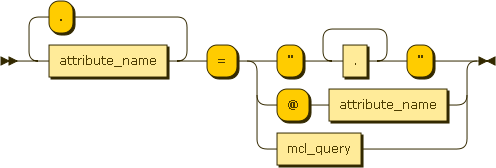

MCL
############

.. _mclquery:

Introduction
-----------------------

MCL is a sadistic parenthesis-oriented query and component creation/update language. It allows to find components based on its attributes and, most important, based on the relationships it has with other components. That way, scripts may easily find all the data they need to run. For exemple, just knowing the hostname of the server it runs on, a script will be able to query all database accounts running on database instances running on this server, and then backup or export them.

MCL can:

* find component instances
* create component instances (including recursive creation for complex component dependencies)
* update the basic fields of an instance (basic meaning: not a relationship)

MCL cannot:

* update a relationship. That would mean altering the very structure of an environment, which is not something that should have to be automated. The manual admin site is here for that kind of one-off operations.

Grammar (EBNF)
-----------------------

.. productionlist:: 
	mcl_query ::= '(' ('(T,' component_type (',' cic)?')' )? ('(S,' attribute_definition (',' attribute_definition)* ')')? ('(E,' envt_name (',' envt_name)* ')')? ('(A,' attribute_definition (',' attribute_definition)* ')')? ('(P,' (parent_field_name ',')? mcl_query ')')* ('(C,' mcl_query ')')* ')'
	update_query ::= mcl_query '(U,' attribute_definition (',' attribute_definition)* ')'
	attribute_definition ::= attribute_name ('.' attribute_name)* '=' (('"' .+ '"') | '@' attribute_name | mcl_query )
	attribute_name ::= [a-zA-Z0-9_]+
	parent_field_name ::= attribute_name 

	
*mcl_query*: 

.. image:: media/mcl_query.png

*attribute_definition*:

*attribute_name*:

.. image:: media/attribute_name.png	

*parent_field_name*:

.. image:: media/parent_field_name.png	

*Diagrams generated with http://railroad.my28msec.com/rr/ui*

How to query
-----------------------

MCL is a **filter** language. That means that it works in a negative fashion: you begin with every existing component instances, and the more filters you add, the less instances survive. It also means that everything is optional in MCL, but the outer parenthesis - in this case, every single last instance is returned.

This section introduces all the different filters, from the simplest to the more complicated.

Query on attributes (simple)
++++++++++++++++++++++++++++++++++++++++++++

In this case, the user knows a few attributes (usually the name) of the required component instance.::

	(S,attribute="value",otherattribute="othervalue",...)
	
S means Self. Double inverted commas are compulsory surounding the value. In case there are some inside the value itself, double the quotes to escape them.

.. warning:: if no type is given (see next paragraph), only base instance attributes can be queried (basically: only 'name' and 'description' are available).

.. note:: Queriable attributes are listed on page /ref/types_details.

	* BASE means the attribute can be queried event without type
	* CAST means the attribute can be queried with type specified
	* REL means it is a relationship attribute - see below
	* NO means the attribute cannot be used in a query

Exemples:::

	((S,name="waPRDINT2"))
	((S,environments="PRD1"))
	((S,description="it's ""beautiful""",name="marsupilami"))

Query on type
++++++++++++++++++++++++++++++++++++++++++++

There are many component instance types: Oracle instances, web servers, batch programs, etc. To filter on this:::

	(T,componenttype)
	
T means Type.

Example::

	((T,wascluster))
	
will return every WebSphere Cluster in he system.

Query on attributes (reference)
++++++++++++++++++++++++++++++++++++++++++++

.. warning:: not implemented.

In this case, the user doesn't know the value of an attribute but knows it is equal to another attribute.::

	(S,attribute=@otherattribute)
	
Note the absence of inverted commas.

Exemple::

	((S,login=@password))

Query on parent/connected instances
++++++++++++++++++++++++++++++++++++++++++++

Instances have a special set of relationships called Parents. To query on this relationships, just create a sub query inside a (P,)::

	((P,((S,name="MYORACLEINSTANCE"))))
	
You can give the name of the parent relationship between the P and the subquery::

	((P,oracle_instance,((S,name="MYORACLEINSTANCE"))))

Same thing with connected instance with (C,)

Mixing it all
++++++++++++++++++++++++++++++++++++++++++++

Just collate the different filters in this order: T, S, P, C. For exemple::

	((T,wasapplication)(S,name="integration", name="integration")(C,((T,oracleschema)(S,name="prd_int")))(P,was_cluster,((T,wascluster)(P,((T,wascell)(S,name="wcellPRD")))))))
	
will look for applications named integration that:

* are linked to an Oracle Schema named prd_int
* run on a cluster (which is not named here)
	* the cluster must run on a cell named wcellPRD

	
Instance creation
-----------------------

To create an instance, add an (A,) section after the S section. This section may be empty (just (A,)) or contain the definition of some attributes values (that you want to set be not use in the S filter definition). It is not recursive: the A only applies to the current component, not its parents or connected friends. If you want to also create these, just put an A section inside the P (or C) sub queries.
The whole expression is used to create the instance: S, P and C. If P relations do not respect the constraints given in the component definition, a user error is raised.

Please note that there are ways to complete the created components through conventions.

.. warning:: adding an A section will slow down the query. Only put it if you want to create an instance.

Instance update
-----------------------

Updating instances is easy: after an SCM query that returns the desired instances, just add an (U,field="value", ...) section.

The following exemple will set the name of every instance to "meuh"::

	()(U,name="meuh")
	
Please note that specifying a type is not compulsory to use its attributes. For exemple::

	((S,name="my_oracle_schema_name"))(U,service_name_to_use="RACCOON")
	
is valid even if the type OracleSchema was not specified. But if the MCL query returns at least one instance that does not have at least one of the attributes specified in the U clause, an error is raised. This would be invalid::

	((S,name="my_unix_server"))(U,service_name_to_use="RACCOON")
	
.. note:: There is no way to script (through MCL or otherwise) a relationship update. It is only possible to query instances, create instances and update the basic (i.e. not relationships) fields of an instance. 

.. note:: A delete is considered a basic update, since instances are never actually deleted to preserve history consistency - so deleting is just a matter of updating the field "deleted" to True.
