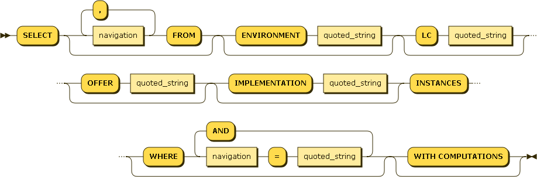
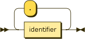
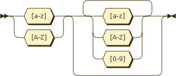

Mage Query Language (MQL)
############################

MQL is an SQL-like language allowing to query the component instance referential easily from everywhere, including from shell scripts.

It allows to find component instances based on their attributes and, most important, based on the relationships they has with other components. That way, scripts may easily find all the data they need to run. For example, just knowing the hostname of the server it runs on, a script will be able to query all database accounts running on database instances running on this server, and then backup or export them.

Grammar (EBNF)
***********************

.. productionlist:: 
	quoted_string ::= "'" .* "'"
    identifier ::= [a-zA-Z] [a-zA-Z0-9]*
    navigation ::= identifier ('.' identifier)*
    query ::= "SELECT" (navigation (',' navigation)* "FROM")? ("ENVIRONMENT" quoted_string)? ("LC" quoted_string)? ("OFFER" quoted_string)? ("IMPLEMENTATION" quoted_string)? "INSTANCES" ("WHERE"  (navigation '=' quoted_string) ("AND" navigation '=' quoted_string)*)? "WITH COMPUTATIONS"?

*mql_query*: 

*navigation*:

*identifier*:

Diagrams generated with http://bottlecaps.de/rr/ui

.. note:: keywords such as SELECT are not actually case sensitive.

How to query
***********************

MQL is a **filter** language. That means that it works in a negative fashion: you begin with every existing component instances, and the more filters you add, the less instances survive. It also means that everything is optional in MQL, but "SELECT INSTANCES" - in this case, every single last instance is returned.

This section introduces all the different filters, from the simplest to the more complicated.

Query on attributes (simple)
++++++++++++++++++++++++++++++++++++++++++++

In this case, the user knows a few attributes (usually the name) of the required component instance.::

	SELECT INSTANCES WHERE port='1789'
	
In this case, 'port' is the name of a field of some (perhaps none!) components. 
This will retrieve all the component instances that have a port field and which port field is equal to 1789.

Simple inverted commas are compulsory surrounding the value. In case there are some inside the value itself, double the quotes to escape them.

Other examples:::

	SELECT INSTANCES WHERE name='ERP_TEC2_PU6'
	SELECT INSTANCES WHERE description='it''s "beautiful" AND name='marsupilami'

    
Query on relations' attributes
++++++++++++++++++++++++++++++++++++++++++++

This is exactly the same as previously, except we use dotted-path notation to access the fields of the related component instances.

Example::

    SELECT INSTANCES WHERE server.dns='my.server.dns.org'
    
will select every component instance that has a relationship named 'server' pointing to another component instance which field 'dns' equals 'my.server.dns.org'.
    
Query on type
++++++++++++++++++++++++++++++++++++++++++++

There are many component instance types: Oracle instances, web servers, batch programs, etc. To filter on this:::

	SELECT IMPLEMENTATION 'compo type' INSTANCES
	
Example::

	SELECT IMPLEMENTATION 'jbossas' INSTANCES
	
will return every JBoss application server in the system.

Query on environment
++++++++++++++++++++++++++++++++++++++++++++

To filter by environment, just use:

	SELECT ENVIRONMENT 'envt name' INSTANCES
	
Example::

	SELECT ENVIRONMENT 'DEV1' INSTANCES

Selecting attributes
++++++++++++++++++++++++++++

Computed fields
---------------------

To avoid useless computations, computed fields are not present in the query results by default. 

To get them, add " WITH COMPUTATIONS" at the end of the query. ::

    SELECT INSTANCES WITH COMPUTATIONS

Other fields
------------------

One can add fields from related instances at the beginning of the query. ::

    SELECT name, server.dns FROM INSTANCES WHERE ...
    
This will only give two attributes: the name of the component instance, and the dns of the server the instance runs on.

.. warning:: this is not efficient. Using computed fields is far better.

Final example
+++++++++++++++++++

::

    SELECT IMPLEMENTATION 'jbossapplication' INSTANCES WHERE datastore.name='prd_int' AND group.domain.name='jbossproddomain'
    
will look for applications named integration that:

* are linked to an Oracle Schema named prd_int
* run on a group (which is not named here)
	* the group must be inside a domain named jbossproddomain

