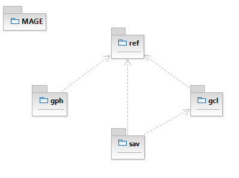
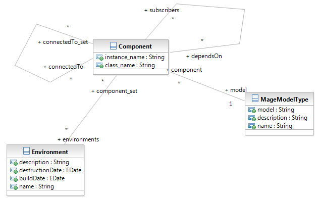
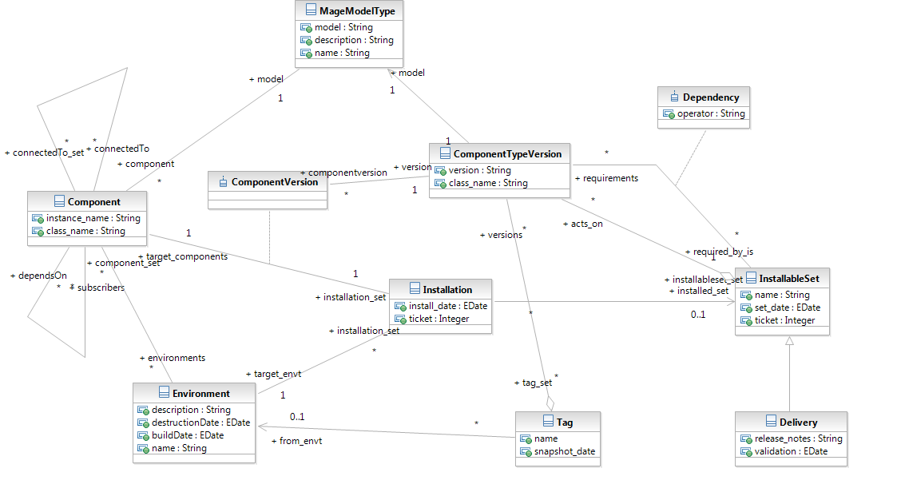

#############################
Structure (A FINIR)
#############################

MAGE est découpé en **modules**\ , chacun étant stocké dans une 
**application Django** indépendante.

C'est le cas autant pour les modules du coeur de l'outil (référentiel,
GCL...) que pour les modules que vous allez apprendre à écrire dans ce
tutorial.

==================
Structure du coeur
==================

Les applications (vu ici comme des packages) sont les suivantes :

-----------
Referentiel
-----------

Le module ref est là où les environnements et les composants sont 
déclarés.

On remarquera en particulier que :

* Un composant appartient à zéro ou plusieurs environnements. En effet  
  un composant peut simplement être un socle (par exemple, un serveur 
  portant plein de composants d’environnements différents n’a aucune 
  raison d’appartenir plutôt à l’un qu’à l’autre), ou bien être mutualisé 
  (par exemple, une instance de gestionnaire de files pourra contenir les 
  files de plusieurs environnements). Le choix se posera souvent entre 
  '0 ou n' pour un socle donné.
* Un composant est *connecté à* * autres composants. Cela doit se voir 
  comme un chemin de données dans une chaîne. Par exemple, un logiciel 
  JMS est connecté au gestionnaire de files. C’est une relation **non 
  orientée** : si A est connecté à B, B sera automatiquement connecté à A.
* Un composant est *abonné à* * autres composants. Il s’agit de la 
  relation d’abonnement classique. Par exemple, un schéma Oracle est 
  abonné à une instance. (dans la suite de ce document, on dira également
  que l’instance est parent du schéma.) C’est une **relation orientée**\ .

---
GCL
---

Ce module est la base de tout la gestion de configuration, et utilise
les objets du référentiel.

----------
PA (TODO)
----------

-----------
GPH (TODO)
-----------